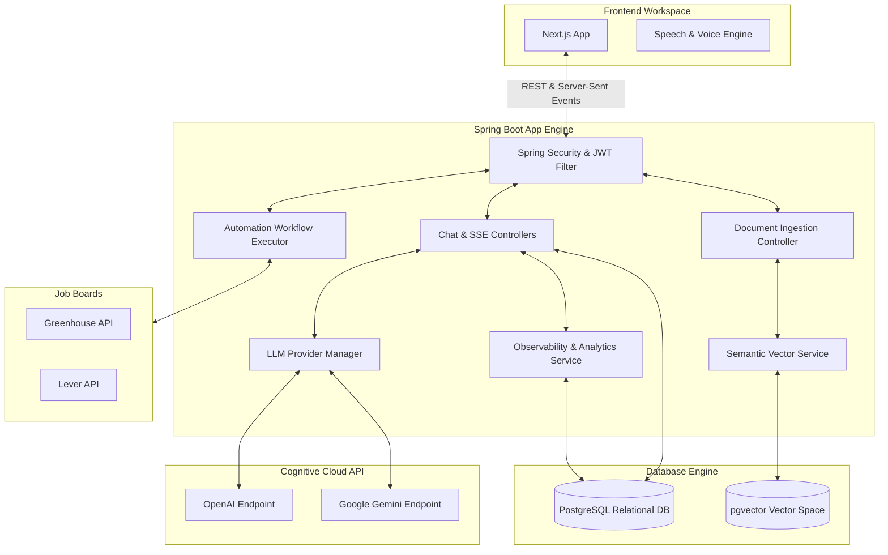
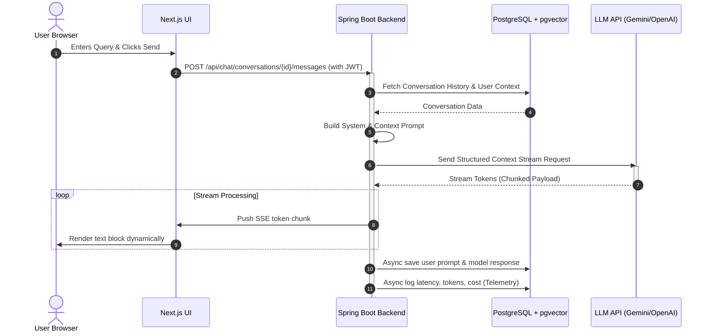
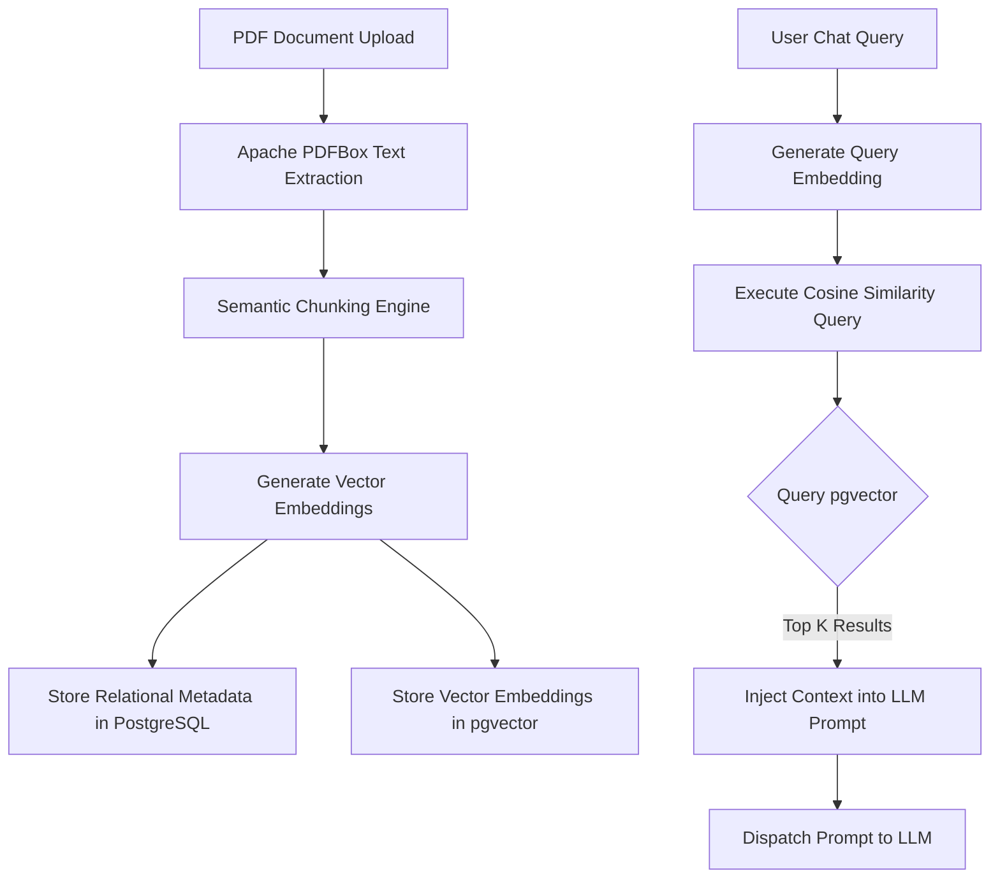
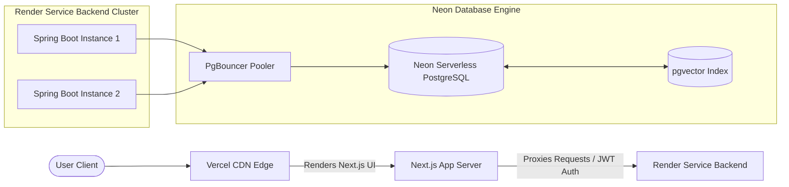

# TraceLM

<div align="center">

### Building the Open-Source AI Operating System.

[](#)
[](#)
[](#)
[](#)
[](#)
[](#)

*An enterprise-grade, high-performance architecture bridging RAG document intelligence, conversational telemetry, real-time streaming, and autonomous workflow automation.*

</div>

---

## 📖 Table of Contents
1. [Why TraceLM?](#-why-tracelm)
2. [Key Highlights](#-key-highlights)
3. [Screenshots](#-screenshots)
4. [Architecture Overview](#-architecture-overview)
5. [System & Request Pipelines](#-system--request-pipelines)
   - [System Architecture Diagram](#system-architecture-diagram)
   - [Request Flow Diagram](#request-flow-diagram)
   - [Conversation Lifecycle](#conversation-lifecycle)
   - [Streaming Architecture](#streaming-architecture)
   - [Memory Architecture](#memory-architecture)
   - [RAG & Ingestion Pipeline](#rag--ingestion-pipeline)
   - [Jobs Automation Architecture](#jobs-automation-architecture)
   - [Provider Abstraction](#provider-abstraction)
   - [Observability Pipeline](#observability-pipeline)
6. [Database Design](#-database-design)
7. [Repository Structure](#-repository-structure)
8. [Technology Stack](#-technology-stack)
9. [Feature Matrix](#-feature-matrix)
10. [Installation & Setup](#-installation--setup)
11. [Deployment Guide](#-deployment-guide)
    - [Production Architecture Diagram](#production-architecture-diagram)
    - [Scaling Strategy](#scaling-strategy)
    - [Security Considerations](#security-considerations)
12. [Design & Coding Standards](#-design--coding-standards)
13. [Evolutionary Roadmap](#-evolutionary-roadmap)
14. [Contributing](#-contributing)
15. [License](#-license)

---

## 💡 Why TraceLM?

Today's AI ecosystems are heavily fragmented. Developers use one tool for tracing/observability, another for conversational memory, a third for vector databases, and separate workflow frameworks to build automation. 

**TraceLM is built to solve this fragmentation.** 

By starting with a robust observability engine, TraceLM captures clean telemetry data from every single model interaction. From this telemetry foundation, we construct continuous memory profiles, build contextual RAG indices, and route tasks to specialized automation services. Rather than acting as a static middle-layer, TraceLM integrates these layers to form the foundation of an **AI Operating System (AI OS)**—a unified system capable of observation, context retention, automated planning, and tool execution.

---

## ✨ Key Highlights

*   **Stateless, Hot-Swappable LLM Gateway**: Standardized Java routing structure supporting real-time configuration switching between Google Gemini and OpenAI.
*   **Zero-Latency Token Streaming**: Built on reactive Spring WebFlux and Server-Sent Events (SSE) to push tokens instantly to the Next.js frontend as they generate.
*   **Vector Memory Co-Location**: Keeps structured transactional data (conversations, logs) and semantic vector data (document chunks, embeddings) inside a single, scalable PostgreSQL database via `pgvector`.
*   **Self-Evaluating Automation**: Career search crawlers fetch live listings from Lever and Greenhouse APIs, then evaluate matches in highly optimized single-request LLM batches (grading 50 jobs at a time) to avoid API rate limits.
*   **Accessibility First**: Native browser-level Voice Speach-To-Text (STT) and Text-To-Speech (TTS) built straight into the chat workspace.

---

## 🖼️ Screenshots

<details>
<summary>📸 Expand to View User Interface Previews</summary>

### Chat & Streaming Workspace
```
+-------------------------------------------------------------+
| [O] Chat    |                                               |
| [D] Docs    | Chat: Gemini-3.1-flash-lite                   |
| [A] Auto    |                                               |
|             | > User: What is the current system status?     |
| [Settings]  | > AI: System status is healthy. Telemetry     |
|             |   is active and capturing all logs.           |
|             |                                               |
|             | [🎙️ Voice Input]         [🔊 Read Aloud]       |
+-------------------------------------------------------------+
```

### Automation Portal
```
+-------------------------------------------------------------+
| Automation Dashboard                                        |
| +---------------------+   +---------------------+           |
| | Career Automation   |   | Workflows           |           |
| | Manage job feeds,   |   | Chain multi-step    |           |
| | matching & profile. |   | agents together.    |           |
| | [Get Started ->]    |   | [Coming Soon]       |           |
| +---------------------+   +---------------------+           |
+-------------------------------------------------------------+
```

### Career Feed Matching
```
+-------------------------------------------------------------+
| Career Feed                                                 |
| +---------------------------------------------------------+ |
| | Software Engineer - Razorpay (Bangalore, India)          | |
| | [======= 88% Match Score =======]                       | |
| | AI Analysis: Matches your React and Spring Boot skills. | |
| +---------------------------------------------------------+ |
+-------------------------------------------------------------+
```
</details>

---

## 🏗️ Architecture Overview

TraceLM decouples core business logic and state management from presentation:

1.  **Backend (Java 21 / Spring Boot 3.2)**: A highly multi-threaded, robust API and runtime engine. Handles LLM provider clients, RAG indexing pipelines (Apache PDFBox), asynchronous telemetry processing, and automation runtimes.
2.  **Frontend (Next.js 16.2 / React 19)**: A client interface built with React Server Components, TypeScript, and Tailwind CSS. Connects to backend endpoints using stateless bearer tokens (JWT) and consumes real-time data using HTML5 Server-Sent Events.
3.  **Database Layer (PostgreSQL + pgvector)**: Acts as the storage engine. Standard tables manage users, conversations, and jobs. The vector extension handles high-dimensional document chunk embeddings for local context search.

---

## 📊 System & Request Pipelines

### System Architecture Diagram



### Request Flow Diagram



### Conversation Lifecycle

1.  **Creation**: A user creates a conversation. The backend persists a metadata entry in the `conversations` table linked to the `User`.
2.  **Turn Ingestion**: When a query is sent, message records are created with a state of `SENT`.
3.  **Context Construction**: The application compiles previous history up to a context window threshold, prepends configured system instructions, and formats it for the specific provider payload model.
4.  **Completion & Storage**: The response stream concludes, the assistant message is persisted to the database, and context tokens are updated.

### Streaming Architecture

TraceLM leverages **Spring WebFlux** to implement asynchronous streams. The controller returns a `Flux<ServerSentEvent<String>>`. The backend processes connection keep-alives and routes streaming chunk tokens received from the LLM client library (via HTTP client streaming) directly to the WebFlux pipeline, preventing any thread-blocking actions or memory bottlenecks on the server container.

### Memory Architecture

TraceLM organizes memory into two distinct pipelines:
*   **Short-Term Transactional Memory**: Managed relational threads in the `messages` table, ordered chronologically per conversation.
*   **Semantic Memory (RAG)**: Relies on `pgvector`. Text fragments extracted from documents are vectorized and stored. In queries, the system uses cosine similarity algorithms to match queries against stored segments to inject highly relevant document context before dispatching tasks to LLMs.

### RAG & Ingestion Pipeline



### Jobs Automation Architecture

Instead of issuing concurrent queries for every job found (which triggers API rate limits), the `CareerAutomationService` utilizes a specialized batch-processing design:
*   It aggregates up to **50 job listings** fetched from Greenhouse or Lever APIs into a single payload.
*   It builds a prompt containing user profile preferences (location, experience, skills) and parsed PDF resume text.
*   It calls Gemini, requesting a clean, structural JSON array mapping the unique listing IDs to calculated matching scores (from 0 to 100).
*   It parses the result using Jackson's `ObjectMapper` and automatically displays the matched jobs in descending order of their score.

### Provider Abstraction

All models conform to the `LLMProvider` interface. The `ProviderManager` selects the active implementation dynamically based on properties defined in the system configurations or requested headers:

```java
public interface LLMProvider {
    LLMResponse generateResponse(List<Message> history, String modelName, boolean stream);
    Flux<String> generateStreamingResponse(List<Message> history, String modelName);
}
```

### Observability Pipeline

Observability is handled asynchronously to prevent API latency overhead. The system logs data in three transactional states:
1.  **Metadata Capture**: Records the timestamp, target model, request size, and user details.
2.  **Latency Measurement**: Measures the exact duration from the initial HTTP dispatch to the final byte stream chunk.
3.  **Cost Auditing**: Computes the exact API token usage and updates database indices to display cost structures on the system dashboard.

---

## 🗄️ Database Design

TraceLM uses a highly relational PostgreSQL schema optimized for speed and vector retrieval:

```
                  +-------------------+
                  |       users       |
                  +-------------------+
                            | 1
                            |
                            | 1..*
                  +-------------------+
                  |   conversations   |
                  +-------------------+
                            | 1
                            |
                            | 1..*
                  +-------------------+
                  |     messages      |
                  +-------------------+
```

### Core Schema Definitions

```sql
-- Users Table
CREATE TABLE users (
    id SERIAL PRIMARY KEY,
    email VARCHAR(255) UNIQUE NOT NULL,
    password VARCHAR(255) NOT NULL,
    name VARCHAR(255)
);

-- Conversations Table
CREATE TABLE conversations (
    id UUID PRIMARY KEY,
    user_id INT REFERENCES users(id) ON DELETE CASCADE,
    title VARCHAR(255),
    created_at TIMESTAMP WITH TIME ZONE DEFAULT NOW()
);

-- Messages Table (Conversational Threading)
CREATE TABLE messages (
    id UUID PRIMARY KEY,
    conversation_id UUID REFERENCES conversations(id) ON DELETE CASCADE,
    role VARCHAR(50) NOT NULL, -- USER or ASSISTANT
    content TEXT NOT NULL,
    created_at TIMESTAMP WITH TIME ZONE DEFAULT NOW()
);

-- Document Registry
CREATE TABLE documents (
    id UUID PRIMARY KEY,
    name VARCHAR(255) NOT NULL,
    file_path VARCHAR(512),
    status VARCHAR(50), -- UPLOADED, PROCESSED, FAILED
    uploaded_at TIMESTAMP WITH TIME ZONE DEFAULT NOW()
);

-- pgvector Context Chunk Storage
CREATE TABLE document_chunks (
    id UUID PRIMARY KEY,
    document_id UUID REFERENCES documents(id) ON DELETE CASCADE,
    content TEXT NOT NULL,
    embedding vector(1536) -- Standard vector size for OpenAI/Gemini Embeddings
);

-- Inference Telemetry Records
CREATE TABLE inference_logs (
    id UUID PRIMARY KEY,
    model_name VARCHAR(100),
    prompt_tokens INT,
    completion_tokens INT,
    latency_ms INT,
    cost DECIMAL(10, 6),
    timestamp TIMESTAMP WITH TIME ZONE DEFAULT NOW()
);
```

---

## 📁 Repository Structure

```
TraceLM/
├── backend/
│   ├── src/
│   │   ├── main/
│   │   │   ├── java/com/tracelm/backend/
│   │   │   │   ├── automation/            # Automation Engine & Services
│   │   │   │   │   ├── career/            # Career Matching & Resume Parsing
│   │   │   │   │   ├── job/               # Job APIs & Lever/Greenhouse Providers
│   │   │   │   │   └── workflow/          # Automation Pipeline & Workflows
│   │   │   │   ├── config/                # Spring & Security Configs
│   │   │   │   ├── controller/            # Chat, Auth, RAG, Audio REST Controllers
│   │   │   │   ├── dto/                   # Data Transfer Objects
│   │   │   │   ├── entity/                # JPA Database Entities
│   │   │   │   ├── provider/              # LLM Gateways (Gemini / OpenAI)
│   │   │   │   ├── repository/            # Relational JPA Repositories
│   │   │   │   └── service/               # PDF Extractors & Business Logic
│   │   │   └── resources/
│   │   │       ├── application.yaml       # Core application settings
│   │   │       └── db/migration/          # Database migrations & schemas
│   └── pom.xml                            # Backend dependencies & compilation definition
├── frontend/
│   ├── src/
│   │   ├── app/                           # Next.js App Router Page layouts
│   │   │   ├── (workspace)/               # Authenticated Workspace Core
│   │   │   │   ├── automation/            # Automation dashboard & sub-views
│   │   │   │   ├── chat/                  # Interactive Streaming Chat workspace
│   │   │   │   ├── dashboard/             # System Telemetry & Cost Dashboard
│   │   │   │   ├── documents/             # Document Management & RAG upload
│   │   │   │   └── memory/                # Persistent memory viewer
│   │   │   ├── login/                     # Authentication & Google Login View
│   │   │   └── layout.tsx                 # Core UI Wrapper & Theme Provider
│   │   ├── lib/                           # API Handlers & Auth helpers
│   └── package.json                       # Next.js and frontend dev specs
```

---

## 💻 Technology Stack

| Tier | Component | Technology | Description |
| :--- | :--- | :--- | :--- |
| **Backend** | Language | Java 21 | High performance, typed system execution |
| **Backend** | Web Framework | Spring Boot 3.2 | Enterprise microservice container |
| **Backend** | Reactive Stack | Spring WebFlux / SSE | Asynchronous reactive streaming APIs |
| **Backend** | Database Access | Spring Data JPA / Hibernate | Entity relations & transaction management |
| **Frontend** | Framework | Next.js 16.2 | Static/Server-side rendering React framework |
| **Frontend** | Language | TypeScript 5.0 | Strong compile-time interface safety |
| **Frontend** | Styling | Tailwind CSS 4.0 | Utilty-first rapid responsive UI building |
| **Database** | Database Engine | PostgreSQL 16 | Relational data persistence engine |
| **Database** | Semantic Engine | pgvector | Native SQL vector indexing and distance query execution |

---

## 📋 Feature Matrix

### ✅ Implemented
*   **Dual-Model Provider Abstraction**: Configured routing mechanisms to invoke OpenAI or Google Gemini endpoints dynamically.
*   **Stateless Telemetry Engine**: Records all input/output metadata, model variables, latency parameters, and token counts.
*   **RAG Engine**: Built-in document text processor utilizing Apache PDFBox to chunk and save data into PostgreSQL.
*   **Batch Job Matches**: Automation engine to fetch Greenhouse and Lever listings, batch them in groups of 50, and use AI to score them.
*   **Real-time Streaming UI**: Chat window with token-by-token streaming, complete conversation history, and voice-assisted TTS/STT options.

### 🚧 In Progress
*   **Custom workflow engine**: Executing conditional sequential automation templates based on user parameters.
*   **Memory Summarization Scheduler**: Automated background service to summarize conversation threads once they exceed a memory token limit.

### 🛣 Planned
*   **Model Context Protocol (MCP)**: Connecting third-party filesystems, databases, and network APIs natively to the chat engine.
*   **Multi-Agent Collaborative Networks**: Spawn separate agents (e.g., Coder, Tester, Researcher) that execute tasks synchronously or asynchronously.
*   **Agent Execution Playground**: UI dashboard to design, run, test, and debug system agent networks.

---

## ⚙️ Installation & Setup

### Prerequisites
*   **Java 21 JDK** (OpenJDK or Oracle)
*   **Node.js 20+**
*   **PostgreSQL 15+** with the **pgvector** extension active.

---

### Step 1: Clone the Project
```bash
git clone https://github.com/lokeshwarM/TraceLM.git
cd TraceLM
```

---

### Step 2: Database Configuration
Install and enable the vector extension on your target database:
```sql
CREATE DATABASE tracelm;
\c tracelm;
CREATE EXTENSION IF NOT EXISTS vector;
```

---

### Step 3: Backend Settings
Configure a `.env` file in the root of the `/backend` folder:
```properties
# System Keys
SPRING_DATASOURCE_URL=jdbc:postgresql://localhost:5432/tracelm
SPRING_DATASOURCE_USERNAME=postgres
SPRING_DATASOURCE_PASSWORD=your_password

# Authentication Credentials
GOOGLE_CLIENT_ID=your_google_client_id.apps.googleusercontent.com
GOOGLE_CLIENT_SECRET=GOCSPX-your_google_secret

# AI Models API credentials
GEMINI_API_KEY=AIzaSy...
OPENAI_API_KEY=sk-proj-...
```

---

### Step 4: Frontend Settings
Configure a `.env.local` file in the root of the `/frontend` folder:
```env
NEXT_PUBLIC_API_URL=http://localhost:8080/api
NEXT_PUBLIC_GOOGLE_CLIENT_ID=your_google_client_id.apps.googleusercontent.com
```

---

### Step 5: Local Execution

**Start the Java Backend Application Engine:**
```bash
cd backend
./mvnw spring-boot:run
```

**Start the Next.js Frontend Server:**
```bash
cd frontend
npm install
npm run dev
```
Open **`http://localhost:3000`** in your browser to access the workspace.

---

## 🌐 Deployment

TraceLM is built to run anywhere. Below is our recommended deployment topography for production instances.

### Production Architecture Diagram



### Scaling Strategy
1.  **Horizontal Scale Web Tier**: The backend is stateless. Users authenticate via signed JWTs, allowing you to scale backend Spring Boot instances under an ALB load balancer without sharing sessions.
2.  **Serverless Database Scaling**: Using Neon PostgreSQL provides serverless auto-scaling compute, adjusting database size automatically to save costs during quiet periods.
3.  **Vector Index Optimization**: For larger datasets (over 100k document chunks), switch the default `pgvector` indexing structure from basic flat index to HNSW (Hierarchical Navigable Small World) to speed up similarity lookups.

### Security Considerations
*   **Secure Telemetry Isolation**: Database telemetry metrics are isolated from the direct user context, preventing users from seeing other users' logs.
*   **Signed JWT Verification**: Every HTTP request checks tokens using Spring Security filters.
*   **Upload Sanitation**: Uploaded documents are read in-memory to verify they are valid PDFs before they are parsed and stored.

---

## 🎨 Design & Coding Standards

1.  **Interfaces First**: All integrations with external systems (LLMs, job scrapers, database indexes) are written behind Java interfaces.
2.  **Asynchronous by Default**: Heavy tasks (processing PDF files, database telemetry updates, LLM analytics evaluations) run asynchronously in separate threads to keep user endpoints fast and responsive.
3.  **Clean Code Practices**: Standard Spring patterns (Constructor Dependency Injection, clear Controller-Service-Repository boundaries) are strictly enforced.

---

## 🗺️ Evolutionary Roadmap

```
  Phase 1: Observability MVP        Phase 2: RAG & Workspace         Phase 3: Automation Hub         Phase 4: AI Operating System
  +-------------------------+      +-------------------------+      +-------------------------+      +-------------------------+
  |  - Telemetry Capture    |      |  - Persistent Memory    |      |  - Advanced Workflows   |      |  - Unified agent swarms |
  |  - Latency Metrics      | ---> |  - RAG Indexing         | ---> |  - Batch job matches    | ---> |  - Model Context Prot   |
  |  - Token Audit Logs     |      |  - WebFlux streaming    |      |  - Multi-step pipelines |      |  - Context Orchestration|
  +-------------------------+      +-------------------------+      +-------------------------+      +-------------------------+
```

---

## 🤝 Contributing

We welcome contributions to the TraceLM project. Please read our architectural guidelines before submitting pull requests. All PRs must pass automated lints and checkstyle validations before review.

---

## 📄 License

TraceLM is released under the **MIT License**. For details, please review the [LICENSE](LICENSE) file.

---

<div align="center">
  <i>TraceLM: Bridging the gap between LLM Telemetry and Autonomous Computing.</i>
</div>
